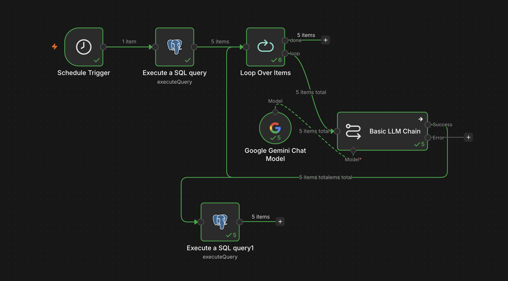

# ConsultBae — AI Automation Take-Home

## Overview

Three CSV exports from three different systems — Naukri applicants, gig workers,
and CBNexus contacts — are merged into one Postgres database where each real
person is a single row, and two things are then built on top of that database:
an n8n automation that tags each person's skill category with an LLM, and a web
app that collects audio recordings and extracts their technical properties. The
five tasks in this repo are: Task 1, the merge pipeline; Task 2, the n8n flow;
Task 3, the audio collection app; Task 4, the data issues report (below); and
Task 5, the scale write-up in [SCALE.md](SCALE.md).

**Live app: https://cb-assignment-7ybc.onrender.com/**

It runs on Render's free tier, which spins the instance down after a period of
inactivity. The first request after an idle spell takes roughly 50 seconds while
the container starts; every request after that is normal speed.

## Architecture

```
source1_naukri_applicants.csv ─┐
source2_gig_workers.csv       ─┼─► load_raw.py ─┬─► raw_naukri / raw_gigs / raw_nexus
source3_cbnexus_contacts.csv  ─┘                └─► quarantine
                                                        │
                                          build_people.py│
                                                        ▼
                                                     people
                                                    ╱      ╲
                                     n8n/flow.json ╱        ╲ app/ (Flask)
                                    (skill_category)         audio_submissions
```

The pipeline is three layers, and the split is deliberate.

**Raw layer.** `load_raw.py` copies each CSV into its own table with every
column as `TEXT` and no cleaning at all, plus a `raw_json` column holding the
original header-to-value mapping. Nothing is interpreted at this stage, because
deciding whether `4.2` means lakhs or rupees is a judgement call and judgement
calls do not belong in a loader. Rows that cannot be trusted into a raw table go
to `quarantine` with a reason rather than being dropped, so the counts always
reconcile: `rows_read == rows_loaded + rows_quarantined`.

**Canonical layer.** `build_people.py` reads the raw tables, normalises values,
and merges records into `people` — one row per real person, carrying
`in_naukri` / `in_gigs` / `in_nexus` flags, the rule that matched
(`match_method`), how much to trust it (`match_confidence`), and a
`needs_review` flag for the cases a human should look at.

**Consumers.** Both Task 2 and Task 3 hang off `people` rather than off the
CSVs, which is the point of doing the merge first. The n8n flow reads `people`,
asks an LLM to classify each person's skills, and writes the answer back to a
`skill_category` column. The audio app writes to `audio_submissions` and links
each submission to `people.id` by normalised phone number. Neither consumer
knows or cares that there were three source files with three different phone
formats — that problem was solved once, in one place.

## Why Supabase Postgres

The brief allows SQLite, MySQL, or Postgres. Three requirements decided it:

**Network reachability.** Both consumers need to reach the database from
somewhere that is not my laptop. n8n queries it on a schedule, and the audio app
was containerised to be deployable. SQLite is a file on one machine, which rules
it out for anything n8n can reach without extra plumbing.

**Integrated object storage.** Task 3 has to store audio files somewhere and
serve them back with a working player. Supabase provides object storage in the
same project as the database, so a submission is one INSERT and one upload
against one set of credentials, instead of a database in one place and an S3
bucket in another.

**Concurrent writes.** SQLite serialises writers and locks the whole database.
Task 5 imagines 5,000 workers submitting over a weekend; even at demo scale, a
web app writing while a scheduled n8n flow updates the same table is exactly the
pattern SQLite handles worst.

MySQL was the familiar option and I rejected it deliberately. It solves the
concurrency and reachability requirements as well as Postgres does, but it would
have meant paying for and configuring separate database hosting *and* a separate
object storage service, then wiring credentials for both into n8n and the app.
Supabase collapses that into one project. The Postgres-specific features I
actually use are small — `JSONB` for `raw_json` and `TIMESTAMPTZ` — so the cost
of the choice is low and the setup saving is real.

## Setup

Requires Python 3.11 and `ffmpeg` on the PATH. The audio app shells out to
`ffmpeg`/`ffprobe` for every metric, so it will not run without it.

```bash
# 1. Clone
git clone https://github.com/Sahil-1359/cb-assignment.git
cd cb-assignment

# 2. ffmpeg (macOS; use apt-get on Linux)
brew install ffmpeg

# 3. Virtual environment
python3.11 -m venv .venv
source .venv/bin/activate
pip install -r requirements.txt
```

Create a `.env` file in the repo root with these three variables. It is
gitignored and is not in the repository:

```
DATABASE_URL       # Supabase Postgres connection string
SUPABASE_URL       # https://<project-ref>.supabase.co
SUPABASE_ANON_KEY  # project anon key
```

In Supabase, create a **public** storage bucket named `audio`, with an INSERT
policy on `storage.objects` for the `anon` role scoped to
`bucket_id = 'audio'`.

Then apply the schema and run the pipeline in this order:

```bash
# 4. Create the tables (or paste schema.sql into the Supabase SQL editor)
psql "$DATABASE_URL" -f schema.sql

# 5. Load the CSVs verbatim into the raw layer
python load_raw.py

# 6. Merge the raw layer into canonical people
python build_people.py

# 7. Run the audio app
python -m app.main        # http://127.0.0.1:5000
```

Order matters: `build_people.py` reads the raw tables, so `load_raw.py` has to
run first.

## How to run each task

### Task 1 — Merge

```bash
python load_raw.py       # 105 read / 102 loaded / 3 quarantined
python build_people.py   # 55 people, 8 needing review
```

Both scripts print their counts. `load_raw.py` also prints each quarantined row
and why it was quarantined.

### Task 2 — n8n automation

In n8n: **Workflows → Import from File →** `n8n/flow.json`. The flow is
`Schedule Trigger → Postgres query → Loop Over Items → Basic LLM Chain (Google
Gemini) → Postgres update`, and it writes a skill category back to each person.

It writes into the `skill_category` column of `people`, which `schema.sql`
creates.

Set the Postgres and Google Gemini credentials in n8n after import — the export
contains credential *references* only, never keys.

Run the flow **after** `build_people.py`, not before. `build_people.py`
truncates `people`, which clears any categories already written.



### Task 3 — Audio app

```bash
python -m app.main
```

`/` takes a name, a phone number, and either a browser recording or an uploaded
file. `/submissions` lists everything collected with a player and the extracted
values. On submit the app extracts duration, sample rate, bitrate, RMS loudness
and a rough SNR estimate, uploads the audio to the Supabase `audio` bucket, and
links the submission to a person by normalised phone number.

It also runs as a container, which is how it was validated for deployment:

```bash
docker build -t cb-audio-app .
docker run -p 8080:8000 --env-file .env cb-audio-app   # http://127.0.0.1:8080
```

It is deployed from that same container at
https://cb-assignment-7ybc.onrender.com/, configured by `render.yaml`. Because
the free tier cold-starts in roughly 50 seconds after idling, the recording
demonstrates it running locally rather than spending a large fraction of a
six-minute video on a loading screen.

### Task 4 — Data issues report

Below.

### Task 5 — Scale write-up

[SCALE.md](SCALE.md).

## Data issues report (Task 4)

Found by profiling all three files before writing any pipeline code
(`profile_data.py` → `profile_report.txt`), then confirmed against the raw CSVs.

**Headline counts from the run against Supabase:** 105 rows read, 102 loaded,
3 quarantined, merged into 55 people, of which 8 need human review, with 17
field conflicts logged during merging.

### source1_naukri_applicants.csv — 42 rows, 0 quarantined

| # | Issue | What I did |
|---|---|---|
| 1 | Phone in three shapes: `+91` + 10 digits (12 rows), bare 10 digits (12), leading `0` + 10 (18) | Strip to digits, drop country code and trunk zero, keep the last 10 into `phone_10`. All 45 stored phones are exactly 10 digits. |
| 2 | City case and whitespace chaos: `NOIDA` / `Noida` / `Noida ` (trailing space), `pune` / `PUNE` / `Pune`, `GURGAON` / `gurugram ` | Trim, collapse internal whitespace, title-case. |
| 3 | City aliases for the same place: Bangalore ≡ Bengaluru, Gurgaon ≡ Gurugram, New Delhi / Delhi NCR / Delhi | Explicit alias map to one canonical name each. 16 raw variants collapsed to 5 cities. |
| 4 | **`Current CTC` mixes two units with no unit column**: 21 rows look like lakhs per annum (2.4–11.9), 21 rows look like rupees (327,287–1,195,422) | Values under 100 treated as LPA, values at or above 100 divided by 100,000. Result is one coherent scale: all 40 stored values fall in 2.40–11.95 LPA, which is itself evidence the split was read correctly. |
| 5 | **`Applied Date` in four formats**: `DD-MM-YYYY` (12), `MM/DD/YYYY` (11), `YYYY-MM-DD` (9), `7 Jul 2026` text (10) | See the date inference below. |
| 6 | 8 numeric dates are ambiguous in isolation — both `DD/MM` and `MM/DD` readings are valid | Resolved by the dash/slash convention below rather than guessed. |
| 7 | Applied dates in the future: `21-08-2026`, `22-08-2026`, `2026-08-19`, `08/19/2026`, `08/16/2026`, `08/21/2026`, `08/13/2026` ×2 | Flagged, not corrected. An application dated after today is impossible, but there is no way to recover the intended date, and silently shifting it would fabricate data. |
| 8 | **Duplicate person under an abbreviated name**: row 25 `R. Verma` and row 31 `Rohit Verma` share email, phone, city, CTC, date and skills | Merged on exact email. Kept `Rohit Verma`: an initial is never preferred over a spelled-out name. Conflict logged. |
| 9 | **Same person, two email addresses**: rows 27 and 37, both `Nikhil Chopra`, same phone `09000000103`, emails `nikhil.chopra70@example.com` and `alt.nikhil.chopra70@example.com` | Merged on phone. Kept the unprefixed address; the `alt.` one is preserved in a new `alternate_emails` column rather than discarded. Conflict logged. |
| 10 | Skills are Title Case here and lowercase in source 2 — same vocabulary, different rendering | Naukri's spelling wins. This is 14 of the 17 logged conflicts and none of them is a real disagreement about content. |

**The date-format inference.** Rather than guessing at the 8 ambiguous dates, I
checked whether the separator predicts the convention. It does, with no
counter-examples:

| Separator | Rows proving `DD` first (first field > 12) | Rows proving `MM` first (second field > 12) |
|---|---|---|
| dash `-` | 9 | 0 |
| slash `/` | 0 | 6 |

Nine dash-separated dates can only be `DD-MM-YYYY`, and no dash-separated date
contradicts that. Six slash-separated dates can only be `MM/DD/YYYY`, and no
slash-separated date contradicts that. Reading dashes as `DD-MM-YYYY` and
slashes as `MM/DD/YYYY` resolves all 8 ambiguous rows without a coin flip. This
also means a naive "always try DD/MM first" parser mislabels `07/12/2026` as
7 December when it is 12 July — the kind of error that silently produces a
future-dated application.

### source2_gig_workers.csv — 32 rows, 2 quarantined

| # | Issue | What I did |
|---|---|---|
| 11 | Line 12 is a **completely empty row** (`,,,,,`) | Quarantined, reason `completely empty row`. |
| 12 | Line 20 is **field-shifted** — every value sits one column left of where it belongs, and it is a shifted duplicate of line 7 (Isha Chopra). Its field count is still 6, so a length check misses it entirely | Quarantined, reason records which column held the email. Detected by an anchor check: `email_id` must contain `@`; if it does not and another column does, the row is shifted. |
| 13 | **10 email addresses in ALL CAPS** (`ISHA.CHOPRA95@…`, `DEEPAK.NAIR44@…`, `VARUN.SAXENA21@…`) | Lowercased before matching. Without this the email join to source 1 silently misses every one of them. |
| 14 | **`rate` mixes units**: 16 rows `N/hr` (330–1483), 14 rows `Nk/month` (15k–79k) | Not collapsed — see the unresolved section below. |
| 15 | `status` inconsistent: `Active` (8) / `ACTIVE` (8) / `active` (5) / `Inactive` (6) / `paused` (3) | Lowercased and mapped to three canonical values. |
| 16 | `status` also contains the value `Pune` (1) | This is contamination from the shifted row at line 20; it disappears once that row is quarantined. |
| 17 | `location` has the same case, whitespace and alias problems as source 1 | Same normalisation. |
| 18 | **Two different people named Deepak Nair** (lines 15 and 32): `deepak.nair44@example.com` vs `deepak.nair57@example.in`, different city, rate and status | Not merged. The name matches but the emails conflict, so both records are kept separately and both flagged `needs_review`. |
| 19 | **No phone column at all** | Structural, cannot be fixed. Determines the whole matching strategy — see cross-file. |

### source3_cbnexus_contacts.csv — 31 rows, 1 quarantined

| # | Issue | What I did |
|---|---|---|
| 20 | Line 16 is a **repeated header row** in the middle of the file. Pandas ingests it as data, which pollutes every column profile — `Verified` gains a value `Verified`, and `Projects Completed` gains a non-numeric value | Quarantined, reason `repeated header row`. |
| 21 | Phone in three shapes: bare 10 digits (13), `91` + 10 (11), `+91-` + 10 hyphenated (6) | Same normalisation as source 1. |
| 22 | **`Verified` has five spellings for two values**: `Y` (5), `Yes` (3), `yes` (6), `N` (7), `No` (9) | Lowercased and mapped to a real `BOOLEAN`. |
| 23 | Names inconsistently ALL CAPS (`RITU SHARMA`, `SAHIL MALHOTRA`, `VARUN SAXENA`) vs Title Case | Title-cased only when the source string is entirely uppercase, so `R. Verma` is not mangled. |
| 24 | City: same problems as the other two files | Same normalisation. |
| 25 | **Two different people named Arjun Mehta** (lines 5 and 28): phones `9000000131` and `9000000272`, different verified status and project counts | Not merged with each other. See the cross-file trap below. |
| 26 | **No email column at all** | Structural. Combined with issue 19, this is the core matching problem. |

### Cross-file

| # | Issue | What I did |
|---|---|---|
| 27 | **No ID is common to all three files.** Source 1 has email *and* phone; source 2 has email only; source 3 has phone only | Source 1 is the hub: source 2 joins to it by email, source 3 by phone. Sources 2 and 3 share no key type at all and can only be linked by name. |
| 28 | Measured overlap: 15 people shared between sources 1 and 2 by email, 25 between 1 and 3 by phone, 20 between 2 and 3 by name only | Used as the sanity check on the merge. Final: 15 people in all three sources, 15 in exactly two, 15 naukri-only, 10 gigs-only, 0 nexus-only. |
| 29 | **Name-collision trap — Arjun Mehta**, appearing in all three files with conflicting identifiers: source 1 (`arjun.mehta9@example.in`, phone `…131`), source 2 (`arjun.mehta77@mailtest.example.org`, no phone), source 3 twice (`…131` and `…272`). Naive name matching fuses four records into one person | Source 1 and source 3's `…131` merged on phone, high confidence. Source 3's `…272` was blocked from merging with them by the phone conflict. Source 2's record was blocked from source 1 by the email conflict. See the unresolved section for what happened to the leftovers. |
| 30 | **Name-collision trap — Deepak Nair**: source 1 (`nair44`, phone `…296`), source 2 has both `nair44` and `nair57`, source 3 `DEEPAK NAIR` phone `…296` | `nair44` merged across all three on email and phone. `nair57` kept separate on the email conflict, both sides flagged. |
| 31 | **Name-collision trap — Nikhil Chopra**: two source 1 rows, same phone, different emails | Merged on phone, which outranks the name rule, so the differing email is a field conflict rather than a merge blocker. See issue 9. |

### Matching rules used

Applied in this order, with the rule that fired recorded in `match_method`:

1. Exact normalised email match → confidence `high`
2. Exact normalised phone match → confidence `high`
3. Name match with no conflicting email or phone → confidence `low`, `needs_review = true`
4. Name match **with** a conflicting email or phone → do not merge, keep both records, flag both `needs_review`

Result across 55 people:

| match_method | confidence | count |
|---|---|---|
| `single_source` | — | 22 |
| `email+phone` | high | 15 |
| `phone` | high | 11 |
| `name` | low | 4 |
| `email` | high | 1 |
| `name+name_conflict_kept_separate` | low | 1 |
| `name_conflict_kept_separate` | — | 1 |

Records are processed naukri → gigs → nexus. On a field conflict the rule is
prefer non-empty, and if both are non-empty and differ, keep the naukri value
and log it. Because naukri is processed first, that reduces to "keep the value
already there". Two conflicts are not resolvable that way because both rows come
from naukri, and those have their own tiebreaks: more complete name wins
(issue 8), and for emails the one another source also knows about wins,
otherwise the unprefixed one, with the loser kept in `alternate_emails`
(issue 9).

### Issues left unresolved, deliberately

**The rate unit ambiguity was not collapsed.** Source 2 quotes 16 workers hourly
(330–1483/hr) and 14 monthly (15k–79k/month). Converting hourly to monthly
requires an hours-per-month factor, and at a plausible 176 hours the hourly
population lands at ₹58k–261k/month against a monthly population of
₹15k–79k/month. The two barely overlap, so any factor I picked would be
manufacturing a number rather than deriving one. Stored as `rate_value` plus
`rate_unit` (`per_hour` / `per_month`) so both are preserved exactly as
supplied. Deciding the conversion is a business question, not a data-cleaning
one.

**Five merges rest on name alone and are flagged for review.** Because sources 2
and 3 share no key type, the only bridge between them is the name. Five people
were merged this way — Arjun Mehta, Manish Bhatia, Divya Chopra, Karan Chopra
and Vikram Mehta — each at `low` confidence with `needs_review = true`. Nothing
contradicts these merges, but nothing confirms them either. The Arjun Mehta case
is the clearest illustration: the source 2 record has an email and no phone, the
source 3 record has a phone and no email, so there is literally no field on
which they could disagree. They may be two different people. The flag is the
honest output, not a resolved answer, and it is why `needs_review` exists as a
column rather than the pipeline picking a winner. This is also why `nexus only`
is 0 — every nexus-only phone found a name match somewhere.

**Future-dated applications were flagged, not corrected** (issue 7).

## Stuck log

### 1. n8n could not reach Supabase

I entered the Supabase’s default connection string into n8n’s Postgres credential
it just timed out without giving any useful error to find out what went wrong it
just didn’t connect.
I assumed it was a wrong password or a firewall issue, so I tried again but the
result was same. Supabase’s direct database endpoint is IPv6 only, where n8n
Cloud has IPv4. So they could not talk.
Supabase has a second endpoint, the Session pooler, which is on IPv4, and
switching to `aws-0-ap-south-1.pooler.supabase.com` with the
`postgres.<project-ref>` this worked.

### 2. Three LLM providers in under an hour

I created an OpenAI API Key on my free account when it returned
`rate limit reached`. I assumed that I was sending too many requests that too in
a very short time so first I thought of batching but when I checked my account I
came to know it was zero so it was a billing error rather than a rate limiting
one.
I moved to Google Gemini: `gemini-2.5-flash` which returned 404
(`no longer available to new users`) then to `gemini-3-flash-preview` returned
429.
While reading the body of the error I saw that it contained
`quotaMetric: generate_content_free_tier_requests` and `quotaValue: 20` which is
a daily cap, not a per-minute one.
I was thinking of adding a wait/delay node but this rules it out.
Quotas are scoped per model, so I tried Gemma, which draws on a separate bucket,
and the flow completed.

### 3. Upload rejected by a bucket that existed

The first submission failed saying that
`new row violates row-level security policy` even when the bucket exists, it was
public and it included the INSERT policy.
Same request was tested twice once as written, once with headers removed one at
a time. The main cause was `x-upsert: true` which is the header that tells
Supabase to overwrite an existing object, which requires an UPDATE policy in
addition to the INSERT policy which the anon did not have.
Object names are UUID4, so there was never a collision to overwrite; the header
was doing nothing except triggering a permission check I did not need. It was
removed which fixed the upload.
